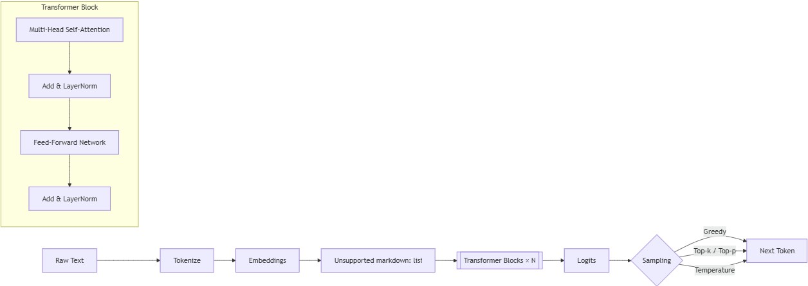
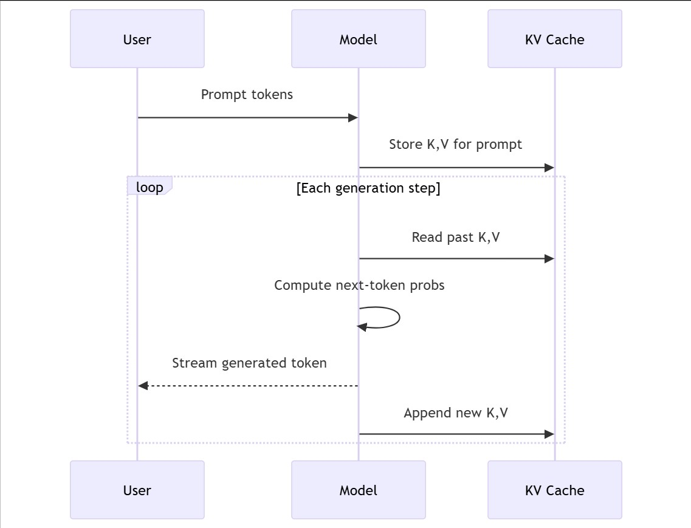

## 🤔 一、为什么需要大模型？(The "Why")

在大型语言模型（LLM）出现之前，机器理解人类语言一直面临着一个巨大的挑战：**上下文依赖（Context Dependency）**。传统的模型很难真正理解长距离的、复杂的语义关系，比如在一篇长文中，代词“它”到底指代的是哪个名词？或者，一段话的真实情感是褒是贬？

LLM 的出现，正是为了解决这个核心痛点。它通过一种被称为 **Transformer** 的强大架构，实现了对长距离上下文的精准捕捉，使得机器能够像人一样，结合前因后果来理解和生成语言。

**核心价值**：LLM 的核心价值在于，它提供了一个**通用**的、可扩展的语言理解与生成框架，让我们能够用前所未有的高效率和低成本，解决无数与自然语言相关的任务。

## 🎯 二、一次请求的“内心之旅”：LLM 如何思考？(The "How-it-Works")

当我们向 LLM 发送一句话（即一个 Prompt）时，它的内部经历了一系列精密而神奇的“加工”流程。这个过程的最终目的，其实非常单纯：**预测出下一个最可能出现的 Token 是什么**。

#### 步骤 1️⃣：食材准备 (Tokenization)

首先，模型不能直接理解我们的文字。它需要先把句子“切”成自己能理解的最小单位，这个单位就是 **Token**。Token 可以是一个词，也可以是半个词或一个标点。

* **原文概念**：Tokens 是亚词单元（例如，Byte-Pair Encoding）。模型在 Token 上操作，而不是原始字符或单词。
* **绝佳类比**：这个过程就像厨师做菜前的备菜环节。他不会把一整头牛直接下锅，而是会把它分解成牛腩、里脊等更小的、便于烹饪的肉块。Tokenization 就是把“句子”这道大菜，切分成模型可以处理的“词块”。

#### 步骤 2️⃣：风味编码 (Embeddings)

切好的“词块”还只是原材料，没有“味道”。接下来，模型需要通过 **Embedding（词嵌入）** 将每个 Token 转换成一个包含丰富语义信息的数学向量。

* **原文概念**：Embeddings 是表示 Token 的密集向量。语义上的相似性映射为几何上的接近性。
* **绝佳类比**：Embedding 就像一个“语义 GPS”。它把每个 Token 定位到一个巨大的多维“意义空间”里。在这个空间里，“国王”和“女王”的坐标离得很近，而“国王”和“香蕉”的坐标则离得很远。同时，为了不让语序混乱，模型还会巧妙地注入**位置信息 (Positional Information)**，告诉自己每个 Token 在句子中的前后位置。

#### 步骤 3️⃣：风味融合 (Self-Attention)

这是 LLM 最核心的“烹饪秘诀”：**自注意力机制 (Self-Attention)**。它让句子中的每个 Token 都能“看到”并“评估”与句子中所有其他 Token 的关系，从而构建出带有上下文感知的全新表达。

* **原文概念**：每个 Token“关注”其他 Token，以建立上下文相关的表示。Q/K/V（查询/键/值）是其核心组件，通过查询与键的匹配度来为值赋予权重。
* **绝佳类比**：想象一场高端的社交晚宴。句子里的每个 Token 都像一位来宾。自注意力机制允许每位来宾（比如 Token "it"）环顾全场，并判断哪些来宾（比如 "the robot"）对理解自己最重要，然后重点与他们“交流”（赋予更高的注意力权重），从而更深刻地融入整个语境。多个**注意力头 (Multi-head Attention)** 则像是开了多场不同主题的平行派对，让 Token 们从不同角度（语法、语义等）建立联系。

#### 步骤 4️⃣：层层精炼 (Transformer Blocks)

一次“社交”可能还不够深入。LLM 会将这个过程堆叠很多层，形成 **Transformer Blocks**。每一层都会在前一层的基础上，对句子的理解进行再加工和提炼。

* **原文概念**：Transformer blocks 是由注意力层和前馈网络层堆叠而成，并带有残差连接和层归一化。
* **绝佳类比**：这就像一个多级精炼的“思想加工流水线”。输入的句子向量经过第一层 Block 的“上下文理解”后，产出一个更丰富的中间表达；这个中间表达再被送入下一层，进行更深度的思考和关联，层层递进，最终得到对整个句子最深刻、最全面的理解。

#### 步骤 5️⃣：预言未来 (Next-Token Prediction)

经过以上所有步骤的深度加工后，模型已经对输入的序列有了非常深刻的理解。最后一步，就是做出它的“预言”了。

* **核心原理**：LLM 的本质是一个**下一个词元预测器 (Next-Token Predictor)**。在 Transformer 结构的末端，模型会输出一个横跨其全部词汇表（可能包含数万个 Token）的**概率分布**。这个列表会告诉我们，在当前输入序列之后，每一个可能的 Token 出现的概率有多大。
* **绝佳类比**：这就像一位绝顶聪明的侦探，在阅读了案件的所有卷宗（输入序列）后，他不会直接给出凶手的名字，而是会拿出一份嫌疑人名单（词汇表），并为每个嫌疑人标注出其作案的可能性（概率）。我们的任务，就是根据这份名单来决定“逮捕”谁。
* **生成循环**：当模型根据概率选出下一个 Token（比如“is”）后，它会把这个新生成的 Token 添加到原始输入的末尾，形成一个新的、更长的序列（“A robot is”）。然后，将这个新序列作为下一次计算的输入，重复上述所有步骤，去预测再下一个 Token。如此循环往复，一个完整的句子、一段话，甚至一篇文章就被“吐”出来了。

## 💼 三、改变世界的力量：LLM 的真实应用 (Real-World Impact)

LLM 不是束之高阁的理论，它正实实在在地改变着各行各业。

* **🤖 智能客服升级**：一家金融科技公司的智能客服，通过 LLM 技术接入了最新的政策文件和产品说明。当用户问“我刚申请的‘未来宝’理财产品，它的提前赎回规则是什么？”时，系统能迅速给出精准、个性化的回答，而非万金油式的通用回复。知名产品如 **Intercom** 已经深度集成了类似能力。
* **💻 软件开发的革命**：开发者正在使用 **GitHub Copilot** 来编写、调试和优化代码。当程序员写下一个函数名和注释，Copilot（背后由 LLM 驱动）就能自动补全整个函数体，甚至生成配套的测试用例，极大地提升了开发效率。
* **🎨 内容创作的“灵感源泉”**：营销团队使用 **Jasper** 或 **Copy.ai** 等工具，输入简单的产品描述和目标受众，就能在几秒钟内生成数十个版本的广告文案、社交媒体帖子或博客大纲，让创意工作不再枯竭。

## ↔️ 四、技术对比与权衡 (The Trade-offs)

理解 LLM，不仅要知其然，还要知其所以然，尤其要懂得其中的关键权衡。

#### 加速的“黑魔法”：KV 缓存 (KV Cache)

LLM 生成文本是一个字一个字（或一个 Token 一个 Token）向外“吐”的。最朴素的方法是，每生成一个新 Token，都把全部的已有序列重新计算一遍注意力。但这效率太低了！

* **痛点**：注意力的计算复杂度与序列长度的平方成正比。序列越长，计算量爆炸式增长。
* **解决方案**：**KV 缓存**。模型在计算第一个 Token 的注意力时，会产生对应的 Key (K) 和 Value (V) 向量。KV 缓存就是把这些已经算好的 K 和 V “缓存”起来。在生成下一个 Token 时，无需对前面的内容进行重复计算，只需计算当前新 Token 的 Q，并与缓存中所有的 K、V 进行交互即可。

* **技术权衡**：
    * **优势**：极大降低了推理延迟，提高了吞吐量，是实现丝滑流畅的流式输出（Streaming）的关键。
    * **劣势**：需要占用额外的显存来存储这些缓存的 K/V 值。上下文窗口越长，所需的缓存空间就越大。这是一种经典的“**空间换时间**”策略。

#### 输出的“指挥棒”：采样策略 (Sampling Controls)

模型最终输出的是一个概率分布，我们如何从这个分布中挑选出下一个 Token 呢？这就需要采样策略。

* **Temperature (温度)**：控制输出的随机性。
    * `低 T 值` (如 0.2)：模型会更倾向于选择概率最高的 Token，输出更具确定性、更保守。适合需要事实准确性的任务，如知识问答、代码生成。
    * `高 T 值` (如 0.8)：模型会“不拘一格”，增加低概率 Token 被选中的机会，输出更随机、更有创造力。适合创意写作、头脑风暴。
* **Top-k**：只在概率最高的 k 个 Token 中进行采样。这可以过滤掉那些非常不靠谱的选项。
* **Top-p (Nucleus)**：从概率最高的 Token 开始，累加它们的概率，直到总和超过一个阈值 p。然后在这些 Token 中进行采样。这比 Top-k 更灵活，当模型非常有把握时，候选集会很小；当模型不确定时，候选集会变大。

## 🔭 五、硬币的两面：局限与未来 (What's Next?)

尽管 LLM 成就斐然，但它远非完美。

* **当前的局限**：
    1.  **知识静态**：模型的知识截止于其训练数据的最后日期，无法获知新信息（这也是 **RAG** 技术致力解决的问题）。
    2.  **计算成本高昂**：训练和部署 LLM 需要巨大的计算资源，成本不菲。
    3.  **幻觉 (Hallucination)**：模型有时会“一本正经地胡说八道”，编造出看似合理但完全错误的信息。
    4.  **性能瓶颈**：随着上下文窗口的增长，注意力机制的二次方复杂度仍然是一个巨大的挑战。

* **未来的方向**：
    1.  **新架构探索**：学术界和工业界正在积极研究超越 Transformer 的新架构（如 Mamba、State Space Models），试图以更线性的复杂度处理更长的序列。
    2.  **效率与规模化**：**混合专家模型 (Mixture-of-Experts, MoE)** 等技术，旨在用更低的计算成本训练出更大、更强的模型。
    3.  **多模态融合**：未来的模型将不再局限于文本，而是能够无缝地理解和生成文本、图像、音频、视频的统一大模型。

## 📝 七、实践者备忘录 (Practical Tips)

最后，为正在或即将在生产环境中使用 LLM 的你，提供一些实用的建议：

-   ✅ **优先选择指令微调模型**：对于通用任务，优先使用经过指令微调（instruction-tuned）的 Checkpoint，它们更“听话”。
-   ✂️ **保持提示词简洁**：清晰、简洁的提示词效果更好。如果需要提供长篇参考资料，考虑去重或精简。
-   **流式输出**：为了更好的用户体验，尽可能使用流式传输（Streaming）返回结果。
-   **服务端批处理**：在服务器端将多个请求打包成一个 Batch 进行处理，可以显著提高吞吐量。
-   🔒 **记录与回归测试**：记录生产环境中的提示词和模型输出（注意脱敏），并建立一个回归测试集，以确保模型迭代后的质量。