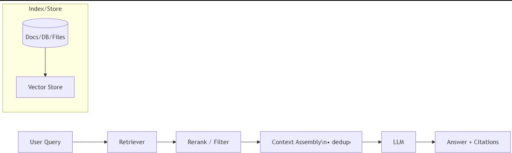
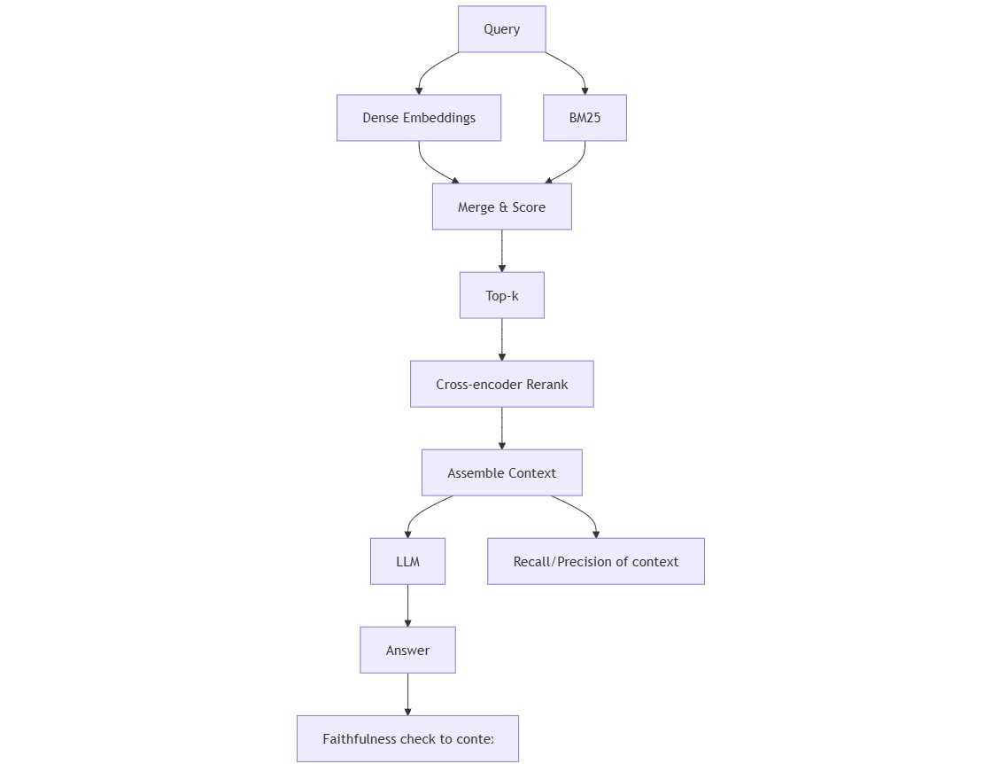

# 🤖 RAG (Retrieval-Augmented Generation)：让大模型学会“开卷考试”的黑魔法

> 原文日期: 2025-09-02  
> 标签: [rag, retrieval, vector, bm25, rerank, evaluation]  
> 摘要: 本文深度解析RAG技术，从为何需要RAG的痛点出发，通过“开卷考试”的类比拆解其核心原理。探讨了从检索器、分块、重排到上下文组装的全流程设计，并结合企业知识库、电商客服等真实案例展示其商业价值。同时，我们将其与Fine-tuning进行深度对比，分析各自的适用场景与优劣，并展望了该技术的未来挑战与发展方向。

---

## 🤔 1. 问题与价值 (The "Why")：我们为什么需要 RAG？

即使是像 GPT-4 这样强大的大语言模型（LLM），也存在两个难以根治的“阿喀琉斯之踵”：

1.  **知识的“保质期”**：模型的知识截止于其训练数据的最后日期。对于日新月异的世界，它就像一个只读了旧版教科书的学生，对新知识一无所知。
2.  **一本正经地“胡说八道”**：当遇到知识盲区时，模型有时会“编造”听起来很有道理的答案，这就是所谓的“幻觉”（Hallucination），在严肃场景下这可能是致命的。

为了解决这些痛点，**检索增强生成（RAG）** 技术应运而生。它不试图去“修改”模型的大脑（训练），而是给了模型一个外挂的、可以实时更新的“图书馆”。

RAG带来的核心价值非常精炼：

-   **✅ 时效性 (Freshness)**：无需重新训练模型，只需更新外部知识库，就能让模型掌握最新信息。
-   **✅ 可靠性 (Provenance)**：模型的回答都有据可查，可以提供引文和出处，方便用户验证信息的真实性。
-   **✅ 经济性 (Cost control)**：相比于针对每个专业领域都进行昂贵的模型微调，构建和维护一个外部知识库的成本要低得多。

## 🎯 2. 核心原理拆解 (The "How-it-Works")：RAG 的“开卷考试”四步法

要理解 RAG，最好的类比就是**“开卷考试”**。

想象一个非常聪明的学生（LLM），他掌握了大量的通用知识。现在他要参加一场关于特定公司内部政策的考试。虽然他很聪明，但他没背过这些具体规定。怎么办呢？

开卷考试允许他带参考资料（外部知识库）。当遇到问题时，他会经历以下四个步骤：

1.  **🤔 提问 (Query)**：学生拿到一个问题，例如：“公司的差旅报销标准是什么？”
2.  **📚 检索 (Retrieve)**：他不会立刻凭空回答，而是先快速翻阅桌上的《公司规章制度手册》（知识库），找到与“差旅”、“报销”相关的几个最相关的章节或段落。
3.  **📝 增强 (Augment)**：他将问题和找到的相关资料放在一起，形成一个更丰富的“临时考卷”。现在的问题变成了：“根据以下资料【资料A、资料B...】，请回答公司的差旅报销标准是什么？”
4.  **✍️ 回答 (Generate)**：最后，这位聪明的学生利用他强大的理解和推理能力，结合手头的资料，生成一个精准、详细且有理有据的答案。

这个过程，就是 RAG 的核心！它将一个需要依赖“记忆”的闭卷考试，变成了一个考察“信息检索和整合能力”的开卷考试，大大提升了回答的准确性和时效性。

## 🛠️ 3. 核心组件深度拆解 (The "Design Choices")

要搭建一个高效的 RAG 系统，就像打造一套精密的考试工具，每个环节都至关重要。

-   **🔍 检索器 (Retriever)**：这是“找资料”的工具。
    -   **稀疏检索 (Sparse)**：像传统的搜索引擎，如 BM25，擅长关键词匹配。优点是速度快、效果稳定。
    -   **密集检索 (Dense)**：基于 Embedding（向量嵌入），能理解语义相似度，即使没有相同关键词也能找到相关内容。
    -   **🏆 混合检索 (Hybrid)**：这是目前业界的主流选择。 它结合了前两者的优点，既能保证关键词的精准匹配，又能捕捉语义的深度关联，召回率更高。除非对延迟或成本有极端要求，否则混合检索是首选。

-   **🧩 分块 (Chunking)**：知识库的“排版”方式。
    -   把长篇文档切分成大小适中的片段（通常为 200-300 个 token），并保留少量重叠部分（10-40%），确保语义的连续性。 也可以采用更智能的“语义分块”，按段落或章节的逻辑结构来切分。
-   **✨ 重排序 (Reranking)**：对初筛结果进行“精读”。
    -   检索器快速找出（例如 Top-k 个）可能相关的文档片段后，重排序器（如 Cross-encoders）会进行更精细的计算，将最相关的内容排在最前面，提升最终答案的质量。
-   **🏗️ 上下文组装 (Context Assembly)**：如何给 LLM “喂”资料。
    -   这是一个工程细节，需要去重、高亮匹配片段，并确保所有内容拼接后不超过模型的 token 限制（即“token 预算”）。
-   **溯源与引用 (Citations)**：
    -   在整个流程中，必须严格追踪每个信息片段的来源文档 ID 和具体位置。 这是实现“有据可查”的关键。可以在 Prompt 中明确指示模型，当引用了资料时，必须以特定格式标注出来。

## 💼 4. 业界应用与案例 (Real-World Impact)

RAG 不是一个停留在论文里的概念，它已经广泛落地于各种真实场景：

-   **🏢 案例一：企业智能知识库**
    * **场景**：一家大型科技公司，内部有海量的技术文档、产品手册和 HR 政策。员工每天花费大量时间寻找信息。
    * **RAG 应用**：他们构建了一个内部问答机器人。当工程师输入“如何为项目申请一个新的 Kubernetes 集群？”时，RAG 系统会从最新的运维文档中检索出准确的申请流程、审批人和链接，而不是返回过时的旧信息。
-   **🛒 案例二：电商智能客服**
    * **场景**：一家电商公司的客服面临大量关于订单状态、退货政策和产品规格的重复性问题。
    * **RAG 应用**：智能客服通过 RAG 接入了公司最新的产品手册和物流政策数据库。当用户询问“我新买的XX型号吸尘器怎么更换HEPA滤网？”时，它能给出精准、实时的图文步骤指导，而不是模棱两可的通用建议。
-   **⚖️ 案例三：金融/法律研究助手**
    * **场景**：律师或金融分析师需要从成千上万页的财报、法规或判例中快速找到关键信息。
    * **RAG 应用**：一个 RAG 驱动的研究工具可以让他们用自然语言提问，如“找出近三年所有关于数据隐私保护的处罚案例”，系统能迅速定位相关文件和段落，并进行初步总结，极大提升研究效率。

**知名产品示例**：[Perplexity AI](https://www.perplexity.ai/) 就是一个典型的面向公众的 RAG 应用，它在回答问题时会附上信息来源的链接，是体验 RAG 威力的绝佳范例。

## ↔️ 5. 技术对比与权衡: RAG vs. Fine-tuning

在优化大模型以适应特定领域时，RAG 和 **Fine-tuning (微调)** 是最常被讨论的两种技术。它们不是“谁取代谁”的关系，而是各有分工的“伙伴”。

| 特性 | 🎨 **Fine-tuning (微调)** | 📚 **RAG (检索增强生成)** |
| :--- | :--- | :--- |
| **核心目标** | **教授新技能、模仿风格** | **注入新知识、确保时效** |
| **绝佳类比** | 送模型去上**“专业培训班”**，学习特定领域的行话、格式和思维方式。 | 给模型一张可以随时访问的**“图书馆卡”**，让它能查阅最新资料。 |
| **工作原理** | 用高质量的“问题-答案”对更新模型的权重，改变模型自身。 | 在不改变模型的情况下，通过外部知识库为其提供回答依据。 |
| **数据时效性** | 知识是静态的，一旦微调完成，知识就固化了。 | 知识是动态的，只需更新知识库，就能获取最新信息。 |
| **幻觉问题** | 可以在一定程度上减少幻觉，但无法根除。 | 通过提供事实依据，能极大地抑制幻觉，答案有据可查。 |
| **成本与速度** | 训练成本高，需要大量高质量数据和计算资源，周期长。 | 实施成本相对较低，索引更新快，能快速响应知识变化。 |
| **适用场景** | 需要模型学习特定**语气**（如客服口吻）、**格式**（如代码生成）或**复杂推理模式**时。 | 需要回答基于**事实**的问题，且知识需要频繁更新的场景，如问答、报告生成。 |

**一句话总结如何选择：**
-   当你希望模型“成为”一个特定领域的专家（学习其思维和表达方式）时，选择 **Fine-tuning**。
-   当你希望模型能“利用”特定领域的知识（查询事实信息）时，选择 **RAG**。
-   在许多高级应用中，两者会**结合使用**：先对模型进行微调，让它适应领域风格，再用 RAG 为其提供实时数据。

## 🔭 6. 局限与未来 (What's Next?)

RAG 虽然强大，但并非万能灵药。它目前仍面临一些挑战：

-   **检索质量是天花板**：“Garbage in, garbage out.” 如果第一步的检索环节就找错了资料或者没找到关键资料，那么即使 LLM 再强大也无能为力。这是整个系统的瓶颈。
-   **评估的复杂性**：如何科学地评估 RAG 系统的表现？我们需要综合评估检索的准确率/召回率（Retrieval metrics），以及最终生成答案的忠实度（Faithfulness）和任务完成度（Task metrics），这是一个复杂的体系。
-   **上下文长度的挑战**：如何将检索到的多份文档有效整合，并在有限的上下文窗口（Token Budget）内传递给 LLM，同时不丢失关键信息，是一个持续优化的工程问题。

**未来展望：**
-   **更智能的检索**：未来的检索可能不再局限于文本，而是融合图数据库、表格、图片等多模态信息的“高级检索”。
-   **自适应 RAG**：系统能自动判断何时需要检索，以及检索哪些知识库，甚至能通过与用户的交互，动态地优化和扩充知识库。
-   **RAG 与 Agent 的融合**：在更复杂的 Agent 工作流中，RAG 将成为其核心的“知识获取”工具，让 AI Agent 能基于实时、可靠的信息进行决策和行动。

## ✨ 6. 总结与实践技巧

总而言之，RAG 是一种极具潜力的技术，它通过“开卷考试”的模式，巧妙地将大模型的推理能力与外部知识库的广度和时效性结合起来，是解决模型幻觉和知识陈旧问题的关键钥匙。

最后，附上一些来自一线的**实践技巧**：

-   **优先选择混合检索**，以实现召回效果的最大化。
-   **保持索引库的“新鲜”**；当底层模型或分词器更新时，记得重新嵌入你的知识库。
-   在 Prompt 中**强制要求引用风格**，当找不到可靠来源时，宁可让模型回答“我不知道”，也不要让它猜测。