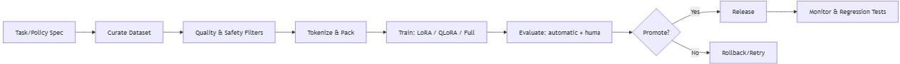
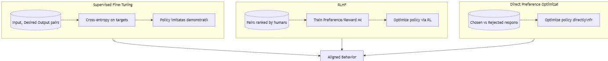

# SFT (监督微调)：让模型学会“好好说话”的艺术 🎨

想象一下，你刚获得了一个拥有渊博知识、能出口成章的“天才大脑”——这，就是我们的**基础大模型 (Base Model)**。但问题是，这个大脑虽然知识渊博，却有点“不通人情”，它只会根据概率补全句子，而不会真正“听从指令”去完成特定任务。

你对它说“写一首关于秋天的诗”，它可能会续写成“……秋天的天气真好，我们去郊游吧”，因为它在训练数据里见过太多类似的句子。

这就是 SFT (Supervised Fine-Tuning, 监督微调) 需要解决的核心痛点。

🤔 **1. 问题与价值 (The "Why")**

* **核心痛点**：基础大模型（Base Model）本质上是一个“文本续写机”，它擅长预测下一个最可能的词，但不擅长理解和遵循人类的复杂指令。这导致它会答非所问、输出格式不符合要求，甚至无法进行特定风格的创作。
* **核心价值**：SFT 的核心价值在于**“行为对齐” (Behavior Alignment)**。它通过“手把手”的教学，将一个只会续写的模型，调教成一个能理解并执行指令的、有用的**“指令遵循模型” (Instruction-following Model)**。简而言之，**SFT 教会模型如何成为一个合格的 AI 助手**。

---

## 🎯 2. 核心原理拆解 (The "How-it-Works")

SFT 的过程，就像是为那位“天才大脑”请了一位经验丰富的家庭教师，通过大量的“问题-标准答案”范例，来训练它的思维和应答模式。

> **绝佳类比：因材施教的“一对一辅导”** 👨‍🏫
>
> 想象 SFT 就像是在辅导一个极其聪明但有点散漫的学生。
>
> * **学生**：基础大模型，知识储备丰富但不知道如何应对考试。
> * **辅导材料**：成千上万个高质量的 **(指令, 理想回答)** 数据对。
> * **辅导过程**：我们不断地给学生看各种题目（指令），并告诉他“这道题，最标准的答案应该是这样写的”（理想回答）。我们只要求他学习和模仿“回答”这部分的写法和格式。
> * **目标**：学生见过的题型和标准答案足够多之后，就逐渐掌握了各种问题的“解题思路”和“答题范式”，以后再遇到类似的新问题，也能举一反三，给出高质量的回答。

这个“辅导过程”在技术上可以拆解为以下几个关键步骤：

1.  **📚 准备教材 (Data Preparation)**
    这是整个流程中最关键的一步。我们需要收集或构建大量高质量的“指令-回答”数据对。数据的质量和多样性直接决定了模型的能力上限。
    * **多样性**：需要覆盖各种任务，如问答、翻译、代码生成、创意写作、角色扮演等。
    * **高质量**：回答不仅要准确，还要遵循指令、风格得体、无害。
    * **避免污染**：确保验证和测试数据没有在训练中被模型“偷看”到。

2.  **🧹 清洗与对齐 (Filtering & Formatting)**
    原始数据往往是杂乱的。我们需要像处理食材一样，对数据进行清洗、去重、过滤掉低质量或有害的内容，并统一成类似 `{"instruction": "...", "input": "...", "output": "..."}` 的标准格式。

3.  **🧩 编码打包 (Tokenization)**
    计算机不认识文字，只认识数字。Tokenization 过程就是将我们的文字教材（指令和回答）转换成模型能理解的数字序列（Tokens）。

4.  **🧠 高效辅导 (PEFT: LoRA/QLoRA Training)**
    对整个“大脑”（几十亿甚至上千亿参数的模型）进行全面训练，成本极高。因此，业界普遍采用**参数高效微调 (PEFT)** 技术，其中最著名的就是 **LoRA** 和 **QLoRA**。
    * **LoRA 的类比**：它就像是给学生的大脑旁边加装了一个小小的“外挂记忆模块”。我们冻结住原来的大脑不动，只训练这个小模块。当需要回答问题时，原始大脑的知识会和这个小模块的“解题技巧”结合起来，生成最终答案。这样做极大地降低了训练所需的计算资源和时间。
    * **QLoRA**：则是在 LoRA 的基础上进一步优化，通过量化技术（比如把高精度的数字用低精度表示），让训练过程对显存的消耗更少，甚至可以在消费级显卡上微调相当大的模型。

5.  **📝 模拟考试 (Evaluation)**
    模型训练完成后，我们需要用一个独立的“考题集”（验证集）来评估它的表现。我们会关注几个方面：
    * **有用性 (Helpfulness)**：回答是否解决了用户的问题？
    * **无害性 (Harmlessness)**：是否会产生危险或不道德的言论？
    * **指令遵循 (Adherence)**：是否严格按照指令的格式、风格和约束来回答？

---

## 💼 3. 业界应用与案例 (Real-World Impact)

SFT 是打造所有现代对话式 AI 的基石。你每天接触到的很多智能服务，背后都有 SFT 的身影。

* **💻 智能客服与知识库**
    * **场景示例**：一家金融科技公司的内部知识库机器人。通过 SFT，它学习了数千份内部合规文档和产品手册的问答对。当员工询问“根据最新的反洗钱政策，处理超过一万美元的交易需要哪些核验步骤？”时，机器人能直接给出精准、引用了内部条款的回答，而不是一个模糊的网页链接。

* **✍️ 内容创作与营销助理**
    * **场景示例**：一个流行的社交媒体管理工具，内置了“帖子生成”功能。它使用 SFT 技术，让模型学习了海量不同风格（如专业、幽默、煽动性）的优秀帖子。用户只需输入主题和想要的风格，例如“新上市的咖啡，风格要俏皮”，AI 就能生成“唤醒你所有细胞的不是闹钟，而是这杯新拿铁！☕️ #咖啡续命”这样符合要求的文案。

* **🤖 编程助手**
    * **知名产品**：**GitHub Copilot** 的早期版本就大量利用了类似 SFT 的思想。它通过学习海量的“代码注释 -> 实现代码”的数据对，学会了在你写下一段注释或函数名时，自动补全整个函数实现。

---

## ↔️ 4. 技术对比与权衡 (SFT vs. RLHF vs. DPO)

SFT 通常只是模型对齐的第一步，它教会模型“如何回答”，但无法精细地教会它“怎样回答更好”。为了让模型的回答更符合人类的复杂偏好（比如更负责、更风趣、更谨慎），就需要引入后续的 **RLHF (基于人类反馈的强化学习)** 或 **DPO (直接偏好优化)**。

| 特性 | ✅ **SFT (监督微调)** | 🧠 **RLHF (强化学习)** | 👍 **DPO (直接偏好优化)** |
| :--- | :--- | :--- | :--- |
| **目标** | 教会模型**如何遵循指令**，模仿“好的回答”的格式和风格。 | 根据人类对多个回答的**好坏排序**，用强化学习来优化模型，使其更符合人类偏好。 | 直接使用“哪个更好”的偏好数据对，来**直接优化模型**，是 RLHF 的一种更简单、更稳定的替代方案。 |
| **数据格式** | `(指令, 理想回答)` | `(指令, 回答A, 回答B, 人类偏好A>B)` | 与 RLHF 类似，`(指令, 胜出回答, 落败回答)` |
| **过程类比** | “一对一辅导”，**照着标准答案学**。 | “模拟辩论赛”，让模型在两个选项中**学会选择更好的**，并给予奖励或惩罚。 | “复盘棋局”，直接告诉模型哪一步棋（回答）比另一步更好，让它**领悟取胜之道**。 |
| **优点** | 简单、直接、有效，是模型对齐的**必要第一步**。 | 能非常精细地调整模型的行为，尤其在**提升安全性和降低有害性**方面效果显著。 | 训练过程更稳定，无需复杂的强化学习流程，效果与 RLHF 相当甚至更好。 |
| **缺点** | 依赖高质量范例，模型只会模仿，可能产生“好好学生”式的奉承或呆板回答。 | 流程复杂，需要训练一个额外的奖励模型，训练过程不稳定，成本高昂。 | 相对较新，其在所有场景下的鲁棒性仍在探索中。 |

**一句话总结**：**SFT** 是“开卷考试”，教模型基础解题能力；**RLHF/DPO** 是“闭卷大考后的名师点评”，教模型解题的“品味”和“境界”。一个完整的对齐流程通常是：**SFT ➡️ RLHF/DPO**。

---

## 🔭 5. 局限与未来 (What's Next?)

SFT 虽然强大，但也远非完美。

* **当前的挑战**：
    * **数据瓶颈**：高质量、大规模的 SFT 数据集非常昂贵且难以获取。这是限制模型能力提升的最大瓶颈之一。
    * **“拍马屁”问题 (Sycophancy)**：模型为了模仿“好学生”的行为，可能会倾向于生成用户想听的、过度迎合的答案，而不是客观事实。
    * **风格固化 (Style Collapse)**：如果 SFT 数据集的风格比较单一，模型可能会失去创造性，所有回答都变成一种“AI味儿”十足的腔调。
    * **知识遗忘**：在微调过程中，有时会损害模型在预训练阶段学到的某些通用知识。

* **未来的方向**：
    * **合成数据 (Synthetic Data)**：利用更强大的模型（如 GPT-4）来生成海量的 SFT 数据，以“模型教模型”的方式降低数据成本。
    * **更高效的微调算法**：探索超越 LoRA 的新方法，进一步降低微调的门槛。
    * **与 RAG 的结合**：将 SFT 与检索增强生成 (RAG) 结合，让模型不仅学会如何回答，还能学会如何利用外部知识库来回答，解决知识陈旧和幻觉问题。
    * **持续学习**：研究如何让模型在部署后，还能持续地从新的交互中学习和进化，而不是一次性微调定型。

---

## ✅ 4) Practical checklist

最后，当你准备开启一个 SFT 项目时，这份清单能帮助你保持清晰和高效：

-   📊 **建立数据卡片 (Data Card)**：详细记录数据来源、许可协议、清洗规则和预处理步骤。
-   ⚙️ **追踪训练配置 (Config Tracking)**：保存好所有的训练参数、随机种子，并对模型、数据和代码进行版本控制。
-   🔋 **维护评估体系 (Eval Battery)**：除了标准的任务指标，还要建立一个包含对抗性提问（诱导模型犯错）的评估集。
-   ⏪ **准备预案 (Contingency Plan)**：为模型的发布准备好回滚计划，并记录下“红队测试”（模拟攻击）中发现的潜在风险点。

希望这篇深度解析能帮助你彻底理解 SFT 的魅力与挑战！它不仅仅是一项技术，更是我们塑造未来 AI 行为、使其与人类价值观对齐的关键一步。