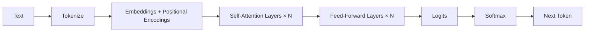

# Basics of Large Language Models (LLMs)

Large Language Models (LLMs) are neural networks trained to predict the next token in a sequence. Modern LLMs use the **Transformer** architecture built around *self‑attention*, which lets the model look at all tokens in parallel and learn which ones matter most for the current prediction.

## Key Concepts

- **Tokens**: Subword pieces used instead of full words (e.g., `Hello` → `Hel`, `lo`). Models operate on tokens rather than raw text.
- **Embeddings**: Dense vectors that represent tokens in a continuous space where semantic similarity ≈ geometric closeness.
- **Positional Encoding**: Adds order information so attention can reason about token positions.
- **Self‑Attention**: Computes how much each token should pay attention to others to form contextual representations.
- **Transformer Blocks**: Stacks of attention + feed‑forward layers with residual connections and layer normalization.
- **Inference**: Given a prompt, the model iteratively samples next tokens until a stop condition (e.g., `max_tokens`, `stop` tokens).

## How a Transformer Processes Text (diagram)

## Scaling & Capabilities

- Larger models, more data, and more compute **generally** improve performance, but with diminishing returns and higher cost/latency.
- Instruction‑tuned models (via SFT/RLHF) follow user intents better than base models trained only for next‑token prediction.
- Context length matters: longer context enables retrieval within the prompt but increases runtime roughly linearly with length.

## Practical Tips

- Prefer instruction‑tuned models for general use.
- Keep prompts concise; reserve long context windows for genuinely needed references.
- Stream tokens for better UX when latency matters.
- Cache responses for repeated prompts; use batching in server settings when throughput matters.

## Glossary

- **KV cache**: Key/Value tensors saved during generation to avoid recomputing attention for past tokens.
- **Top‑p / top‑k**: Nucleus / k‑best sampling controls for creativity vs. determinism.
- **Temperature**: Higher → more random; lower → more deterministic.

## Further Reading
- “Attention Is All You Need,” Vaswani et al., 2017.
- NeurIPS 2017 paper PDF and arXiv abstract.
