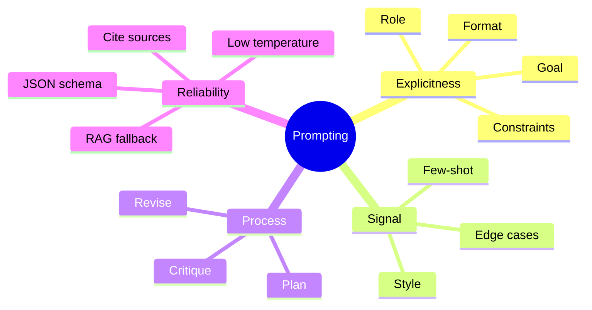

# Prompt Engineering: Patterns that Work

Prompt engineering means designing inputs that consistently elicit good outputs. Think of it as **UI/UX for language models**.

## Core Principles

- **Be explicit**: State role, goal, format, and constraints.
- **Constrain the output**: Ask for JSON, a table, or a checklist when structure matters.
- **Provide signal**: Use *few‑shot* examples that match your target style and edge cases.
- **Decompose**: Break complex asks into steps (plan → act → verify).

## Reusable Patterns

1. **Role + Goal + Constraints**
   > You are a security reviewer. Goal: find high‑risk issues. Constraints: explain impact, likelihood, and mitigation as bullet points.

2. **Few‑Shot Style Transfer**
   Provide 2–3 labeled examples and a clear delimiter; keep examples short.

3. **Chain‑of‑Thought *without* leaking internal reasoning**
   Ask the model to *think stepwise internally* but **only return the final answer** or a compact summary (to protect sensitive chain‑of‑thought).

4. **Critic/Refine Loop**
   - Draft → Critique → Revise (possibly with two model calls).

5. **Schema‑First JSON**
   Provide a JSON schema and ask the model to validate before answering.

## Evaluation & Guardrails

- **Test sets**: Create small prompt test suites with expected outputs.
- **Determinism**: Use low temperature for deterministic tasks.
- **Refusal handling**: Include safety instructions and fallback behaviors.
- **Hallucination control**: Require citations, or route to RAG for facts.

## Prompt Pattern Map (diagram)



## Example Template

```
System: You are a helpful, honest assistant.
User goal: Summarize the following document into 3 bullets and a 1‑line TL;DR.
Output format: JSON with keys ["bullets", "tldr"].
Constraints: If content is insufficient, say "insufficient data".
Document: <<<...>>>
```

## Further Reading
- Prompt design guides from research labs and frameworks; empirical best practices evolve quickly.
