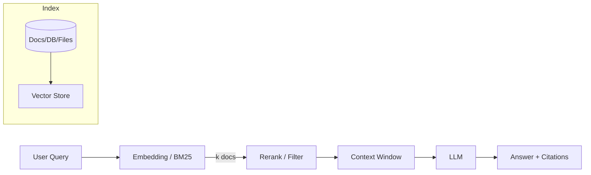

# Retrieval‑Augmented Generation (RAG)

RAG augments an LLM with an external knowledge store. At query time, relevant passages are **retrieved** and injected into the prompt so the LLM can ground its answer in evidence and cite sources.

## Why RAG?

- **Accuracy & Freshness**: Use up‑to‑date data without re‑training the model.
- **Provenance**: Show citations; enable human verification.
- **Cost control**: Fine‑tuning isn’t required for each domain change.

## Typical Architecture (diagram)

## Design Choices

- **Retriever**: Dense (embeddings) vs. sparse (BM25) or **hybrid**.
- **Chunking**: Overlap (e.g., 200–300 tokens with 20–40 overlap) vs. semantic splitting.
- **Reranking**: Cross‑encoder for precision on top‑k.
- **Context assembly**: Deduplicate, window by query terms, enforce token budget.
- **Citations**: Track doc IDs and spans for each chunk included.
- **Evaluation**: Use answer faithfulness (supports claims), context recall/precision, exact‑match/F1 for QA.

## Common Pitfalls

- **Over‑stuffed context** → higher latency and more noise.
- **Embedding drift** → regenerate vectors when model or tokenizer changes.
- **Domain terms** → add synonyms or use domain‑tuned embeddings.

## Further Reading
- Lewis et al., 2020: Retrieval‑Augmented Generation.
- Faiss (vector search library) for fast nearest‑neighbor search.
