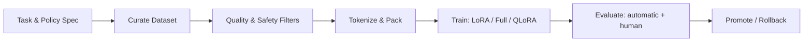

# Supervised Fine‑Tuning (SFT)

SFT adapts a base LLM to follow instructions by training on **input → desired output** pairs (human‑written or distilled). It’s often the first step before preference‑based tuning (RLHF) or direct preference optimization (DPO).

## Pipeline (diagram)

## Key Decisions

- **Data**: High‑quality demos; cover edge cases; remove contamination/leaks.
- **Objective**: Cross‑entropy on targets; supervise only on **answer spans** for conversational data.
- **Parameter‑Efficient Tuning**: LoRA/QLoRA for cost and memory savings.
- **Validation**: Hold‑out sets; measure helpfulness, harmlessness, and adherence to specs.
- **Overfitting**: Watch for verbatim training leakage and narrow style collapse.

## SFT vs RLHF vs DPO

- **SFT**: Learn to imitate demonstrations.
- **RLHF**: Learn a **preference model** from human rankings, then optimize a policy against it (e.g., PPO).
- **DPO**: Directly optimize the policy from ranked pairs without a separate reward model.

## Practical Tips

- Start with SFT to set behavior; add RLHF/DPO only if needed.
- Prefer PEFT (LoRA/QLoRA) unless you must update all weights.
- Evaluate with task‑specific checklists and adversarial prompts.

## Further Reading
- Ouyang et al., 2022: InstructGPT (SFT + RLHF).
